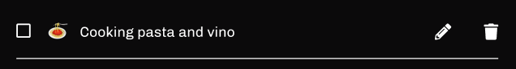
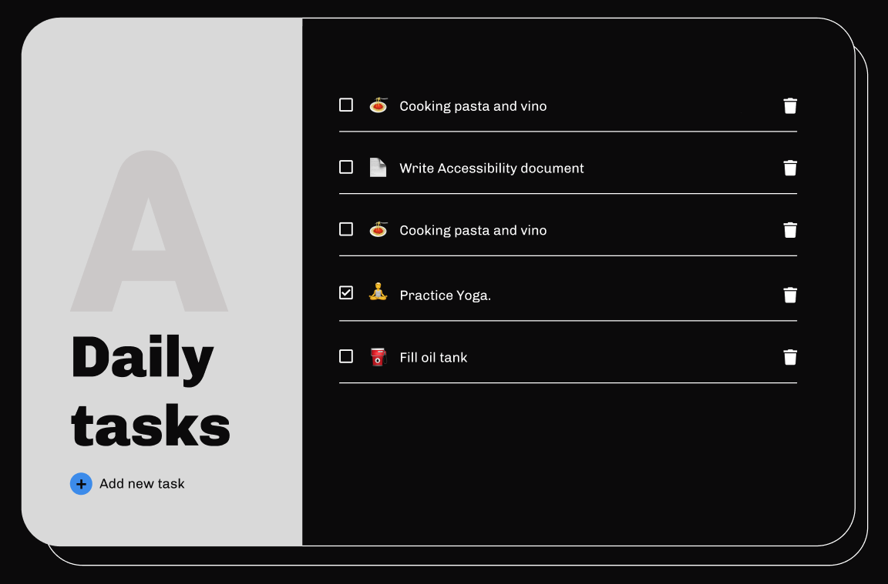

# Animus Coop. | Prueba Técnica React

## Objetivos

### 1. Obtener data de la API

Crear un custom hook que obtenga la lista de ToDos de la API. El hook debe devolver un objeto con 2 elementos: `todos` y `refresh`.

```javascript
const { todos, refresh } = useFetchToDos();
```

Usar dicho hook en la vista `Home` para obtener la lista de ToDos y mostrarlos en pantalla.

Opcional: agregar un boton para refreshear la lista de ToDos.

### 2. Maquetación
Maquetar el componente `ToDoItem` de acuerdo al diseño proporcionado.



El aspecto definitivo del home debe ser el siguiente:



A su vez, el *title* del componente debe tacharse al estar completado.


### 3. POSTear data en la API

Crear una función que permita POSTear un nuevo ToDo en la API. La función debe recibir como parámetro el title del ToDo y el emoji. La funcion debe devolver una promesa que resuelva con el nuevo ToDo creado.

```javascript
const createToDo = (title, emoji) => {
  // ...
  return new Promise((resolve, reject) => {
    // ...
    resolve(newToDo);
  });
}
```

Usar dicha función en la vista `AddNewTask` para crear un nuevo ToDo al hacer click en el botón de crear.

### 4. Borrar data de la API

Crear una función que permita borrar un ToDo de la API. La función debe recibir como parámetro el id del ToDo. La funcion debe devolver una promesa que resuelva con el id del ToDo borrado.

```javascript
const deleteToDo = (id) => {
  // ...
  return new Promise((resolve, reject) => {
    // ...
    resolve(id);
  });
}
```

Usar dicha función en el componente `ToDoItem` para borrar el ToDo al hacer click en el botón de borrar.